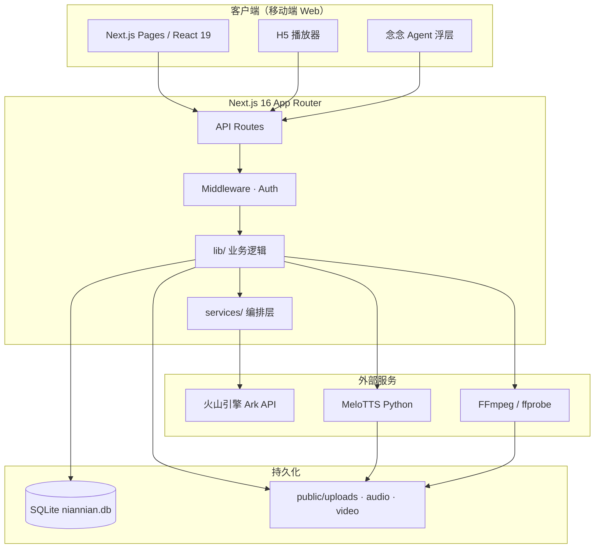
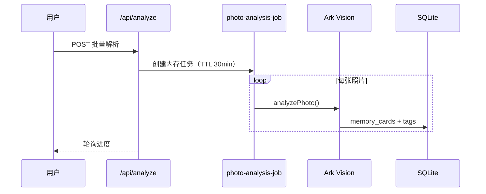
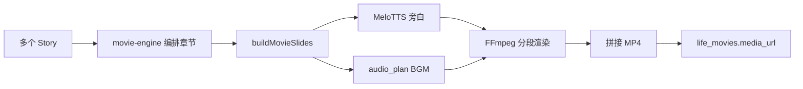
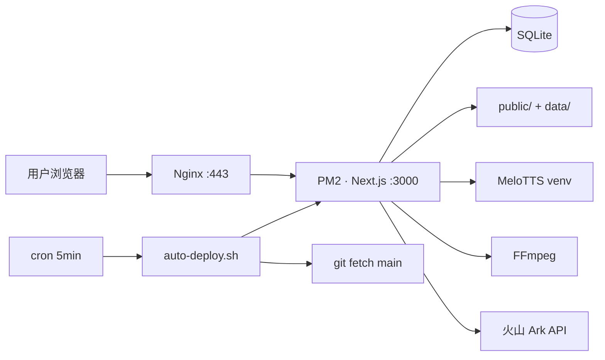

# 念念年年 · 系统架构

> 更新：2026-08-10

---

## 架构总览



---

## 技术栈

| 层 | 技术 |
|----|------|
| 框架 | Next.js 16.3（App Router）、React 19、TypeScript |
| 样式 | Tailwind CSS 4、shadcn/ui（Radix） |
| 数据库 | SQLite + better-sqlite3（WAL 模式） |
| AI | 火山引擎 Ark（Vision + Text），openai SDK 兼容 |
| TTS | MeloTTS（中文 CPU，`services/narration/.venv`） |
| 媒体 | FFmpeg（MP4 渲染）、Sharp（图片预处理） |
| 认证 | HMAC Session Cookie + 手机 OTP |
| 进程管理 | PM2 |
| 反向代理 | Nginx（200MB 上传、长超时） |

---

## 目录结构

```
niannian/
├── src/
│   ├── app/                 # 页面 + API Routes
│   │   ├── api/             # 28 个 API 端点
│   │   ├── family/          # 家庭 · 照片 · 解析 · 故事
│   │   ├── stories/         # 故事库 + H5 播放
│   │   ├── movies/          # 人生电影 + MP4/H5 播放
│   │   └── share/           # 公开分享页
│   ├── components/
│   │   ├── h5/              # InteractiveStoryPlayer, MovieVideoPlayer
│   │   ├── providers/         # Auth, Dialog, Agent, Appreciate
│   │   └── ui/              # shadcn 组件
│   ├── hooks/               # useNarration, useThemeMusic, useSharePoster
│   ├── lib/                 # 核心业务（59+ 模块）
│   └── services/            # 批处理编排
├── services/narration/      # MeloTTS Python CLI
├── public/
│   ├── uploads/             # 照片（运行时）
│   ├── audio/narration/     # 旁白 WAV
│   └── video/movies/        # 渲染 MP4
├── data/niannian.db         # SQLite
├── scripts/                 # 部署 · TTS · 重渲染
└── deploy/                  # Nginx 配置
```

---

## 核心业务管道

### 照片解析管道



### 故事生成管道

```
memory_cards (completed)
    → story-engine/cluster.ts（时间+主题聚类）
    → story-engine/theme.ts（提取主题）
    → story-engine/compose.ts（AI 撰写章节）
    → stories + story_memory_cards + story_versions
```

### 人生电影管道



**播放模式：**

| 模式 | 组件 | 旁白来源 |
|------|------|----------|
| 沉浸式欣赏 | `MovieVideoPlayer` | MP4 内混音 |
| 互动版 H5 | `InteractiveStoryPlayer` | 实时加载 WAV / TTS |

---

## API 路由分组

| 分组 | 路由 | 说明 |
|------|------|------|
| 认证 | `/api/auth/*` | OTP 登录、退出、加入家庭 |
| 家庭 | `/api/family` | CRUD |
| 照片 | `/api/upload`, `/api/photos` | 上传、列表、删除 |
| 解析 | `/api/analyze/*` | 批量/单张 AI 解析 |
| 记忆卡 | `/api/memory-card/*` | 读写、AI 追问 |
| 故事 | `/api/story/*` | 生成、组合、发布、再生 |
| 电影 | `/api/movie/*` | 生成、渲染、旁白预取 |
| 媒体 | `/api/uploads/*`, `/api/audio/*`, `/api/video/*` | 静态文件服务 |
| 语音 | `/api/speech/*` | STT 转写、TTS 合成 |
| 搜索 | `/api/search` | 全局记忆检索 |
| 分享 | `/api/share` | 生成分享码 |
| Agent | `/api/agent/context` | 念念进度统计 |

**Next.js Rewrites：** `/uploads/*`、`/audio/narration/*`、`/video/movies/*` → 对应 API 路由

---

## 念念 Agent 架构

```
GlobalNianNianAgent（全局浮层 z-55）
    ├── NianNianHelpDesk（5 步引导）
    ├── agent-pipeline.ts（统计 family 进度）
    ├── agent-steps.ts（5 步定义 + href）
    └── agent-events.ts（页面上下文消息）
```

**5 步：** 上传 → 解析 → 补充 → 故事 → 电影

---

## 部署拓扑



| 环境变量 | 用途 |
|----------|------|
| `ARK_API_KEY` | AI 主 Key（无则演示模式） |
| `AUTH_SECRET` | Session 签名 |
| `MELO_PYTHON` | MeloTTS 解释器路径 |
| `HF_ENDPOINT` | HuggingFace 镜像（默认 hf-mirror.com） |

---

## 双模式

| 模式 | 入口 | 特点 |
|------|------|------|
| 创造模式 | 默认 | 完整 5 步流程、编辑、生成 |
| 欣赏模式 | `/appreciate` | 只读播放、大字号、零操作自动播 |
