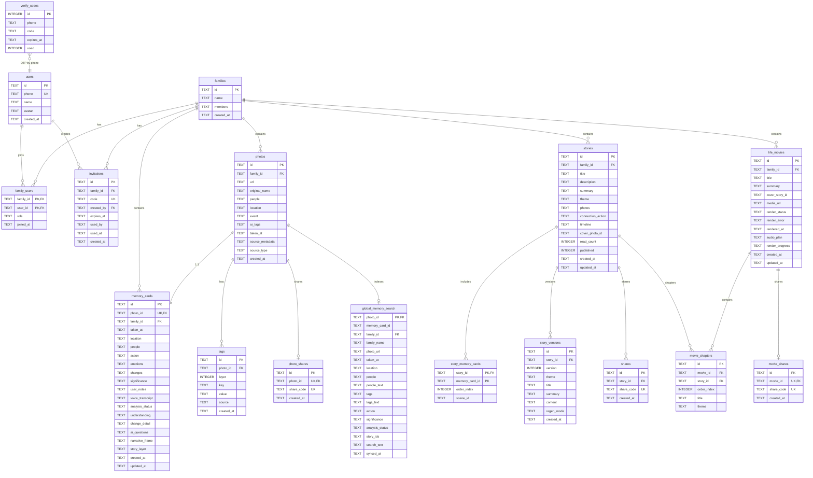
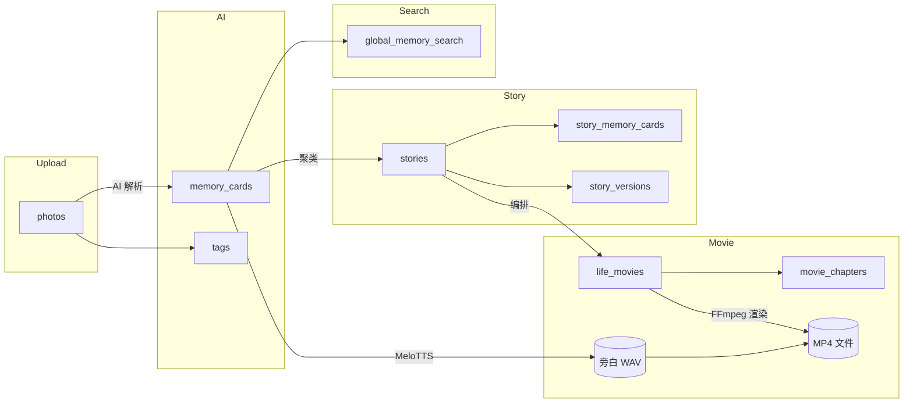

# 念念年年 · 数据库架构

> 引擎：SQLite（`better-sqlite3`）  
> 文件：`data/niannian.db`  
> 模式：WAL + 外键约束  
> 源码：`src/lib/db.ts`（含运行时 migration）

---

## 整体 ER 图



---

## 表分组说明

### 1. 用户与家庭（Auth）

| 表 | 职责 |
|----|------|
| `users` | 注册用户（手机号唯一） |
| `verify_codes` | 短信 OTP 验证码（一次性） |
| `family_users` | 用户 ↔ 家庭多对多，含角色 `owner` / `member` |
| `invitations` | 家庭邀请码，供新用户加入 |
| `families` | 家庭空间，`members` 为遗留 JSON 字段 |

**隔离规则：** 所有业务数据通过 `family_id` 关联；API 层 `family-access.ts` 校验当前用户是否属于该家庭。

---

### 2. 照片与记忆卡（Memory）

| 表 | 职责 |
|----|------|
| `photos` | 原始照片元数据 + 存储 URL |
| `memory_cards` | AI 解析后的结构化记忆（1 照片 : 1 记忆卡） |
| `tags` | 四层标签体系（layer 1–4） |

**Memory Card 分层字段：**

| 字段 | 层级 |
|------|------|
| `taken_at`, `location`, `people`, `action` | 事实层 |
| `emotions`, `changes`, `significance`, `understanding` | 理解层（情动理论 DH2012） |
| `change_detail`, `narrative_frame` | 变化 / 叙事框架 |
| `story_layer` | 故事层（供 Story Engine 使用） |
| `user_notes`, `voice_transcript`, `ai_questions` | 用户补充 |

**`analysis_status`：** `pending` → `analyzing` → `completed` / `failed`

---

### 3. 故事（Story）

| 表 | 职责 |
|----|------|
| `stories` | 故事主表（标题、主题、时间线 JSON） |
| `story_memory_cards` | 故事 ↔ 记忆卡关联；**`photo_id` 为 canonical 字段**，`memory_card_id` 历史兼容（值同为 `photo_id`） |
| `story_versions` | 重新生成历史版本 |
| `shares` | 故事分享码 |

**Story Engine 流程：** 聚类记忆卡 → 提取主题 → AI 撰写章节 → 选封面

---

### 5. 任务队列（Job Queue · 2026-08）

| 表 | 职责 |
|----|------|
| `schema_migrations` | 版本化迁移记录 |
| `jobs` | 持久化异步任务（type/status/payload/progress/idempotency_key） |
| `job_events` | 任务事件流（created/progress/completed/failed） |
| `media_assets` | 媒体资产元数据（对象存储迁移预留） |

---

### 6. 人生电影（Life Movie）

| 表 | 职责 |
|----|------|
| `life_movies` | 电影主表 + 渲染状态 |
| `movie_chapters` | 章节（每个 Story 一章） |
| `movie_shares` | 电影分享码 |

**`render_status` 状态机：**

```
none → queued → rendering → ready
                         ↘ failed
```

**`audio_plan`（JSON）：** 每段 slide 的 BGM、旁白文件路径、`hasNarration`、`durationMs`  
**`media_url`：** 渲染完成的 MP4 路径，如 `/video/movies/{id}.mp4`

**旁白 WAV 不在 DB：** 存于 `public/audio/narration/movies/{movieId}/{slideId}.wav`

---

### 7. 分享

| 表 | 对象 | 公开路由 |
|----|------|----------|
| `shares` | 故事 | `/share/{share_code}` |
| `photo_shares` | 单张记忆 | `/share/{share_code}` |
| `movie_shares` | 人生电影 | `/share/{share_code}` |

---

### 6. 检索读模型

| 表 | 职责 |
|----|------|
| `global_memory_search` | 扁平化搜索索引（非业务真相源） |

写入时机：记忆卡解析完成、故事关联变更时同步。  
查询入口：`GET /api/search`，支持时间 / 人物 / 地点筛选。

---

## 数据流图



---

## 索引一览

| 表 | 索引 |
|----|------|
| `photos` | `idx_photos_family` |
| `stories` | `idx_stories_family` |
| `memory_cards` | `idx_memory_cards_family`, `idx_memory_cards_photo` |
| `tags` | `idx_tags_photo`, `idx_tags_layer` |
| `story_memory_cards` | `idx_story_memory_cards_story` |
| `story_versions` | `idx_story_versions_story` |
| `life_movies` | `idx_life_movies_family` |
| `movie_chapters` | `idx_movie_chapters_movie` |
| `family_users` | `idx_family_users_user` |
| `shares` / `photo_shares` / `movie_shares` | `idx_*_code` |
| `global_memory_search` | `idx_gms_family`, `idx_gms_taken_at`, `idx_gms_location`, `idx_gms_analysis_status`, `idx_gms_people_text`, `idx_gms_tags_text` |

---

## 运行时文件（非 DB）

| 路径 | 内容 |
|------|------|
| `public/uploads/` | 用户上传照片 |
| `public/audio/narration/` | MeloTTS 旁白 WAV |
| `public/video/movies/` | FFmpeg 渲染 MP4 |
| `.cache/melo-batch/` | TTS 批处理临时目录 |
| `.cache/numba/` | MeloTTS Numba 缓存 |

---

## Migration 策略

所有 schema 变更通过 `migrateDatabase()` 在应用启动时执行：

- 新表：`CREATE TABLE IF NOT EXISTS`
- 新列：`PRAGMA table_info` 检测后 `ALTER TABLE ADD COLUMN`
- 无独立 migration 文件；以 `db.ts` 为唯一真相源
